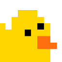

  

<h1 align="center">GitAnimals on Desk</h1>

AI 코딩 에이전트의 작업 상태를 실시간으로 감지해 화면 위에서 살아 움직이는 데스크톱 펫입니다. 프롬프트를 입력하면 생각하고, 툴이 실행되면 타이핑하고, 서브에이전트가 늘어나면 저글링하고, 작업이 완료되면 기뻐하고, 자리를 비우면 잠드는 — 당신의 코딩 세션을 함께하는 동반자입니다.

[GitAnimals](https://gitanimals.org) 캐릭터를 활용하며, [clawd-on-desk](https://github.com/rullerzhou-afk/clawd-on-desk)를 기반으로 만들어졌습니다.

> Windows 11, macOS, Ubuntu/Linux를 지원합니다.

## 설치

[Releases 페이지](https://github.com/git-goods/gitaniamals-on-desk/releases)에서 운영체제에 맞는 패키지를 다운로드하세요.

| OS | 파일 |
|----|------|
| Windows | `.exe` (NSIS 인스톨러) |
| macOS | `.dmg` |
| Linux | `.AppImage` / `.deb` |

## 주요 기능

### 지원 에이전트

- **Claude Code** — command hook + HTTP 권한 hook 완전 통합, 앱 시작 시 자동 등록
- **Codex CLI** — `~/.codex/sessions/` JSONL 로그 자동 폴링, 별도 설정 불필요

에이전트 설정 상세 및 원격 SSH·WSL 환경: **[docs/setup-guide.md](docs/setup-guide.md)**

### 애니메이션 & 인터랙션

- **12가지 애니메이션 상태** — idle, thinking, typing, building, juggling, conducting, error, happy, notification, sweeping, carrying, sleeping
- **수면 시퀀스** — 60초 유휴 시 하품 → 꾸벅 → 쓰러짐 → 수면; 마우스 움직임에 깜짝 기상
- **드래그** — 어떤 상태에서도 잡아서 이동 가능, 놓으면 즉시 복귀
- **미니 모드** — 화면 오른쪽 끝으로 드래그하거나 우클릭 → 미니 모드; 가장자리에 숨고 마우스를 올리면 나타남

<!-- TODO: 애니메이션 GIF 테이블 추가 예정 -->

전체 이벤트→상태 매핑 및 클릭 반응 상세: **[docs/state-mapping.md](docs/state-mapping.md)**

### 권한 버블

Claude Code가 툴 실행 권한을 요청할 때, 터미널 대신 화면에 플로팅 카드가 나타납니다.

- **Allow / Deny / Suggestion** — 원클릭 승인·거부, 권한 규칙 적용 (예: "Always allow Read")
- **글로벌 단축키** — `Ctrl+Shift+Y` (허용) / `Ctrl+Shift+N` (거부), 버블이 표시될 때만 활성화
- **스택 레이아웃** — 여러 권한 요청이 화면 우하단에서 위로 쌓임
- **자동 닫힘** — 터미널에서 먼저 응답하면 버블이 자동으로 사라짐

### 세션 인텔리전스

- **다중 세션 추적** — 모든 에이전트의 세션을 독립적으로 추적, 최고 우선순위 상태를 표시
- **서브에이전트 감지** — 서브에이전트 1개: juggling, 2개 이상: conducting
- **터미널 포커스** — 우클릭 → Sessions 메뉴에서 특정 세션의 터미널 창으로 바로 이동
- **프로세스 생존 감지** — 에이전트 비정상 종료·크래시 감지 후 고아 세션 자동 정리
- **재시작 복구** — 에이전트 실행 중 앱이 재시작되면 유휴 상태 대신 활성 상태 유지

### 시스템

- **클릭 통과** — 투명 영역은 클릭이 아래 창으로 전달됨; 캐릭터 몸통만 인터랙티브
- **위치 기억** — 재시작해도 마지막 위치 유지 (미니 모드 포함)
- **중복 실행 방지** — 단일 인스턴스 잠금
- **자동 시작** — Claude Code의 SessionStart hook이 앱이 꺼져 있으면 자동으로 실행
- **방해 금지(DND)** — 우클릭 또는 트레이 메뉴에서 수면 모드 진입, 모든 hook 이벤트 차단
- **사운드 이펙트** — 작업 완료·권한 요청 시 짧은 효과음 (우클릭 메뉴에서 토글, 10초 쿨다운, DND 시 자동 음소거)
- **시스템 트레이** — 크기(S/M/L), DND, 자동 시작, 업데이트 확인
- **다국어** — 영어·중국어 UI; 우클릭 메뉴 또는 트레이에서 전환
- **자동 업데이트** — GitHub 릴리스 확인; Windows는 종료 시 설치, macOS/Linux는 `git pull` + 재시작

에이전트별 제한사항 전체 목록: **[docs/known-limitations.md](docs/known-limitations.md)**

## 로드맵

- 눈동자 추적 — idle 상태에서 커서를 따라 시선 이동
- 클릭 반응 — 더블클릭 콕콕, 4회 연속 클릭 발버둥

## 기여

버그 리포트, 기능 제안, Pull Request 모두 환영합니다. [이슈](https://github.com/git-goods/gitaniamals-on-desk/issues)를 열어 논의하거나 PR을 바로 보내주세요.

## Acknowledgments

- 이 프로젝트는 [clawd-on-desk](https://github.com/rullerzhou-afk/clawd-on-desk) by [@rullerzhou-afk](https://github.com/rullerzhou-afk)를 기반으로 만들어졌습니다.
- 캐릭터는 [GitAnimals](https://gitanimals.org)의 아트워크를 사용합니다.

## License

소스 코드는 [MIT License](LICENSE)로 배포됩니다.

**아트워크(assets/)는 MIT 라이선스에 포함되지 않습니다.** 저작권은 각 권리자에게 있습니다. 자세한 내용은 [assets/LICENSE](assets/LICENSE)를 참고하세요.

- **GitAnimals** 캐릭터 아트워크의 저작권은 [GitAnimals](https://gitanimals.org)에 있습니다.
